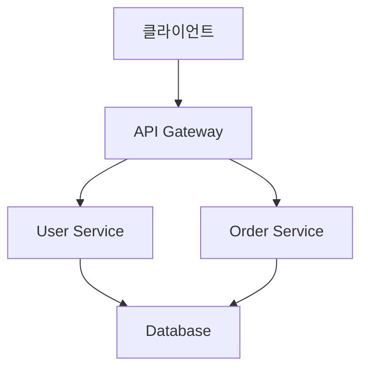

# Motoo Tech Blog - 마크다운 포스팅 가이드

## 📝 마크다운 포스팅 방법

### 1. 새 포스트 생성하기

#### 방법 1: `_posts` 디렉토리에 직접 생성

```bash
# _posts 디렉토리에 마크다운 파일 생성
touch _posts/2024-01-20-새-포스트-제목.md
```

#### 방법 2: 카테고리별 디렉토리에 생성

```bash
# 각 카테고리 디렉토리에 마크다운 파일 생성
touch architecture/새-아키텍처-포스트.md
touch domain/새-도메인-포스트.md
touch implementation/새-구현-포스트.md
touch testing/새-테스트-포스트.md
touch troubleshooting/새-문제해결-포스트.md
```

### 2. Front Matter 작성

각 마크다운 파일의 맨 위에 다음 형식으로 메타데이터를 작성하세요:

```yaml
---
layout: post
title: "포스트 제목"
description: "포스트에 대한 간단한 설명"
date: 2024-01-20
categories: [architecture, spring-boot]
tags: [java, microservices, ddd]
author: "작성자 이름"
---
```

#### Front Matter 옵션 설명:

- `layout`: 포스트 레이아웃 (기본값: post)
- `title`: 포스트 제목
- `description`: 포스트 설명 (SEO용)
- `date`: 작성 날짜 (YYYY-MM-DD 형식)
- `categories`: 카테고리 배열
- `tags`: 태그 배열
- `author`: 작성자 이름

### 3. 마크다운 작성

#### 기본 마크다운 문법

```markdown
# 제목 1

## 제목 2

### 제목 3

**굵은 글씨**
_기울임 글씨_
`코드`

[링크 텍스트](URL)


> 인용문

- 목록 항목 1
- 목록 항목 2
  - 하위 목록

1. 번호 목록 1
2. 번호 목록 2
```

#### 코드 블록

````markdown
```java
public class Example {
    public static void main(String[] args) {
        System.out.println("Hello, World!");
    }
}
```
````

```bash
# 터미널 명령어
java -version
```

```yaml
# YAML 설정
spring:
  application:
    name: example-service
```

#### 표 작성

```markdown
| 컬럼1   | 컬럼2   | 컬럼3   |
| ------- | ------- | ------- |
| 데이터1 | 데이터2 | 데이터3 |
| 데이터4 | 데이터5 | 데이터6 |
```

### 4. 포스트 예시

```markdown
---
layout: post
title: "Spring Boot 마이크로서비스 구현 패턴"
description: "Spring Boot를 활용한 마이크로서비스 아키텍처 구현 방법과 모범 사례를 다룹니다."
date: 2024-01-20
categories: [implementation, spring-boot]
tags: [java, microservices, spring-boot, ddd]
author: "Motoo Team"
---

# Spring Boot 마이크로서비스 구현 패턴

## 개요

이 포스트에서는 Spring Boot를 활용한 마이크로서비스 아키텍처의 구현 패턴과 모범 사례에 대해 알아보겠습니다.

## 1. 프로젝트 구조

### 패키지 구조
```

com.motoo
├── controller
├── service
├── repository
├── entity
├── dto
├── config
└── common

````

### 주요 컴포넌트

#### Controller Layer
```java
@RestController
@RequestMapping("/api/v1/users")
public class UserController {

    @GetMapping("/{id}")
    public ResponseEntity<UserDto> getUser(@PathVariable Long id) {
        // 구현 내용
    }
}
````

#### Service Layer

```java
@Service
@Transactional
public class UserService {

    public UserDto createUser(CreateUserRequest request) {
        // 비즈니스 로직
    }
}
```

## 2. 모범 사례

### 의존성 주입

- 생성자 주입 사용
- `@Autowired` 어노테이션 생략

### 예외 처리

- 글로벌 예외 핸들러 구현
- 커스텀 예외 클래스 정의

### 검증

- Bean Validation 활용
- 비즈니스 규칙 검증

## 결론

Spring Boot를 활용한 마이크로서비스 구현 시 위의 패턴들을 참고하여 일관성 있고 유지보수가 용이한 코드를 작성할 수 있습니다.

````

### 5. 이미지 및 파일 첨부

#### 이미지 첨부
```markdown

````

#### 파일 다운로드 링크

```markdown
[설계 문서 다운로드](/assets/documents/design-doc.pdf)
```

### 6. 카테고리별 포스팅 가이드

#### 아키텍처 카테고리

- 시스템 설계 문서
- 아키텍처 패턴 설명
- 기술 스택 비교
- 확장성 전략

#### 도메인 카테고리

- 비즈니스 도메인 분석
- 엔티티 설계
- 도메인 이벤트
- 비즈니스 규칙

#### 구현 카테고리

- 코드 구현 방법
- 라이브러리 사용법
- 디자인 패턴 적용
- 성능 최적화

#### 테스트 카테고리

- 테스트 작성 방법
- 테스트 도구 사용법
- 테스트 전략
- 품질 보증

#### 문제해결 카테고리

- 트러블슈팅 가이드
- 성능 튜닝
- 장애 대응
- 디버깅 방법

### 7. 포스트 작성 체크리스트

- [ ] Front Matter 작성 완료
- [ ] 제목과 설명이 명확한가?
- [ ] 카테고리와 태그가 적절한가?
- [ ] 마크다운 문법이 올바른가?
- [ ] 코드 블록에 언어 지정했는가?
- [ ] 이미지 경로가 올바른가?
- [ ] 링크가 정상 작동하는가?
- [ ] 오타 검사 완료

### 8. 포스트 게시

1. 마크다운 파일을 적절한 디렉토리에 저장
2. Git에 커밋 및 푸시
3. GitHub Pages에서 자동 빌드 확인
4. 사이트에서 포스트 확인

### 9. 유용한 팁

#### 마크다운 에디터 추천

- **VS Code**: 마크다운 프리뷰 지원
- **Typora**: 실시간 프리뷰
- **Obsidian**: 노트 앱 형태
- **GitHub**: 웹 에디터

#### 마크다운 확장 기능

- **Mermaid**: 다이어그램 작성
- **MathJax**: 수식 작성
- **PlantUML**: UML 다이어그램

#### 예시 다이어그램



### 10. 문의 및 지원

포스팅 관련 문의사항이 있으시면:

- GitHub Issues 등록
- 팀 이메일: team@motoo.com

---

**Happy Blogging! 🚀**
